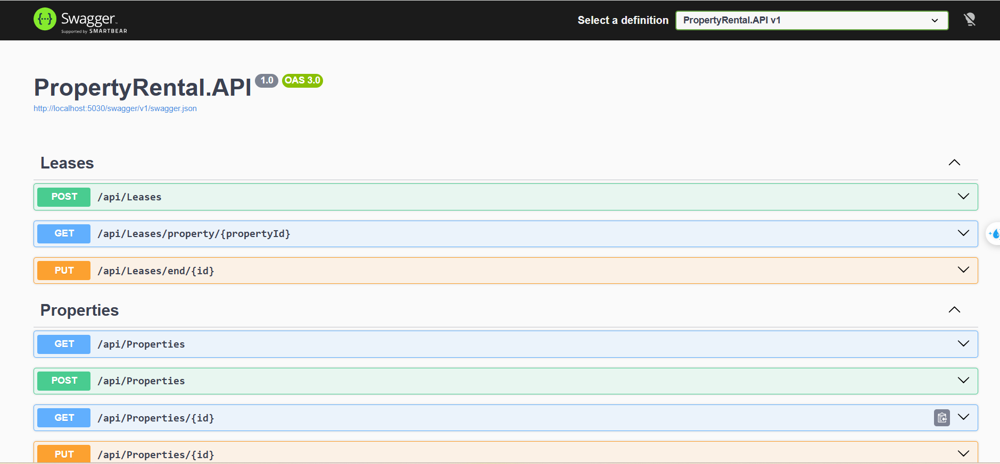
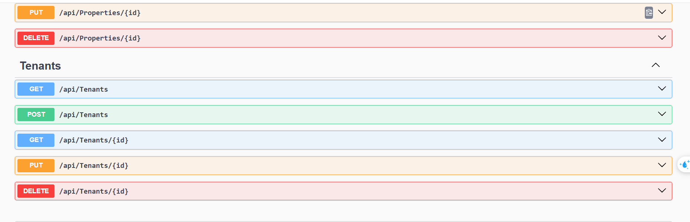
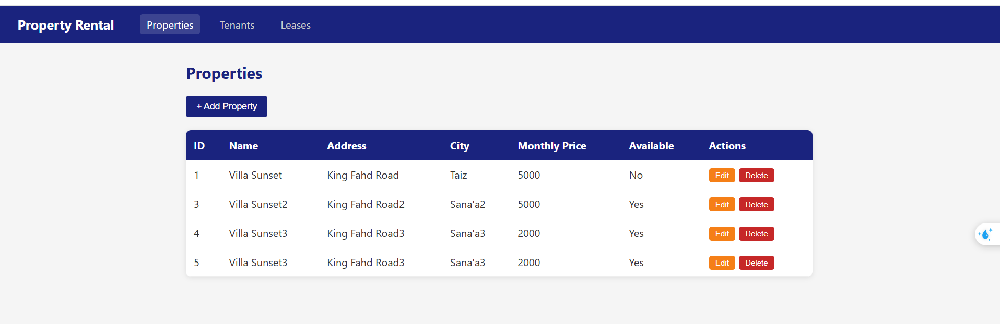
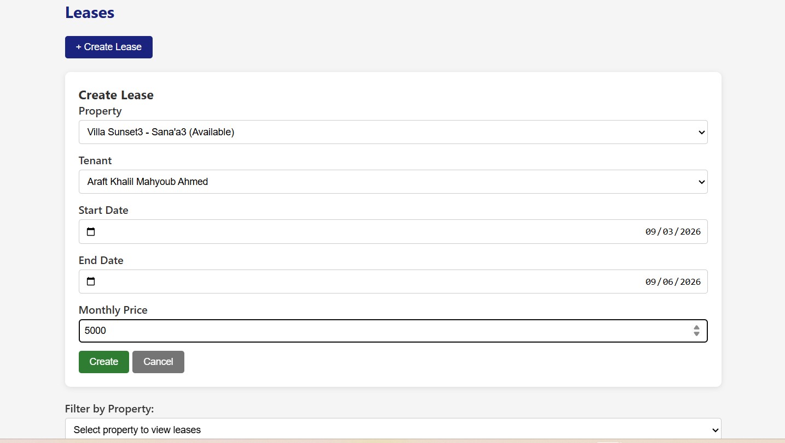
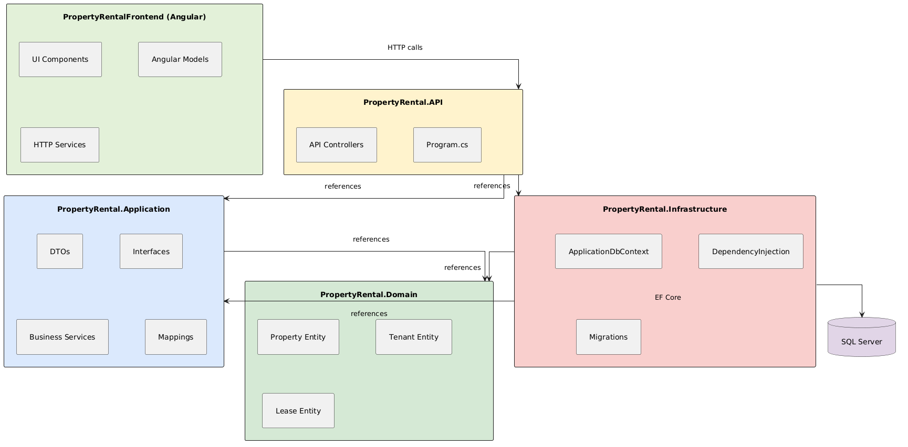
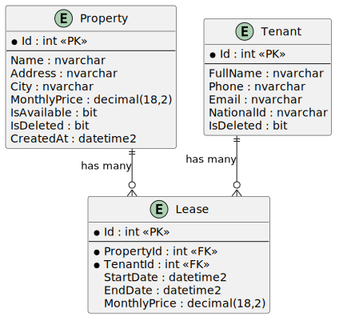

# Property Rental Management System

> Author: **Arafat Khalil**

### Navigation

- [English](#english)
- [Arabic](#arabic)

---

<a id="english"></a>

## [EN] Project Overview

A full-stack property rental management system built as a technical assessment. The system handles property listings, tenant records, and lease contract management with strict enforcement of business rules. Both backend and frontend are fully functional and connected.

## Architecture & Tech Stack

The project follows **Clean Architecture**, organized into four distinct layers:

```
PropertyRental.Domain/            Entities (Property, Tenant, Lease)
PropertyRental.Application/       DTOs, Interfaces, Services, AutoMapper Profiles
PropertyRental.Infrastructure/    EF Core DbContext, Migrations, DI Registration
PropertyRental.API/               Controllers, Middleware, Program Configuration
PropertyRentalFrontend/           Angular SPA (Standalone Components)
```

| Layer       | Technology                          |
|-------------|-------------------------------------|
| Backend     | ASP.NET Core Web API (.NET 10)      |
| Frontend    | Angular (Standalone Components)     |
| Database    | SQL Server (LocalDB)                |
| ORM         | Entity Framework Core (Code First)  |
| Mapping     | AutoMapper                          |

### Dependency Flow

```
API --> Application --> Domain
Infrastructure --> Application --> Domain
```

The Domain layer has zero external dependencies. The Application layer defines interfaces that the Infrastructure layer implements, following the Dependency Inversion Principle.

## Database Schema

```
+------------------+         +------------------+
|    Property      |         |     Tenant       |
+------------------+         +------------------+
| PK  Id           |         | PK  Id           |
|     Name         |         |     FullName     |
|     Address      |         |     Phone        |
|     City         |         |     Email        |
|     MonthlyPrice |         |     NationalId   |
|     IsAvailable  |         |     IsDeleted    |
|     IsDeleted    |         +--------+---------+
|     CreatedAt    |                  |
+--------+---------+                  |
         |                            |
         | 1:M                        | 1:M
         |                            |
+--------+----------------------------+---------+
|                    Lease                       |
+------------------------------------------------+
| PK  Id                                         |
| FK  PropertyId                                 |
| FK  TenantId                                   |
|     StartDate                                  |
|     EndDate                                    |
|     MonthlyPrice                               |
+------------------------------------------------+
```

**Relationships:**
- One Property can have many Leases (1:M)
- One Tenant can have many Leases (1:M)

## Business Rules

1. A property cannot be leased if its `IsAvailable` flag is `false`.
2. A property cannot have overlapping lease periods.
3. When a lease is created, the associated property is automatically marked as unavailable.
4. When a lease is ended, the property reverts to available status.

## Bonus Features Implemented

- **Filtering**: Properties can be filtered by city name and availability status via query parameters.
- **Pagination**: The properties endpoint supports server-side pagination with `page` and `pageSize` parameters.
- **Soft Delete**: Properties and tenants are not physically removed from the database. A Global Query Filter excludes records marked with `IsDeleted = true`.

## API Endpoints

### Properties
| Method | Endpoint                  | Description                      |
|--------|---------------------------|----------------------------------|
| GET    | `/api/properties`         | List (supports filter/pagination)|
| GET    | `/api/properties/{id}`    | Get by ID                        |
| POST   | `/api/properties`         | Create                           |
| PUT    | `/api/properties/{id}`    | Update                           |
| DELETE | `/api/properties/{id}`    | Soft delete                      |

### Tenants
| Method | Endpoint               | Description    |
|--------|------------------------|----------------|
| GET    | `/api/tenants`         | List all       |
| GET    | `/api/tenants/{id}`    | Get by ID      |
| POST   | `/api/tenants`         | Create         |
| PUT    | `/api/tenants/{id}`    | Update         |
| DELETE | `/api/tenants/{id}`    | Soft delete    |

### Leases
| Method | Endpoint                            | Description         |
|--------|-------------------------------------|---------------------|
| POST   | `/api/leases`                       | Create a lease      |
| GET    | `/api/leases/property/{propertyId}` | Get by property     |
| PUT    | `/api/leases/end/{id}`              | End an active lease |

## Prerequisites

- .NET 10 SDK
- Node.js v18 or later
- Angular CLI (`npm install -g @angular/cli`)
- SQL Server (LocalDB or full instance)

## Getting Started

### 1. Clone the repository

```bash
git clone https://github.com/Arafatkhalil/PropertyRentalSystem.git
cd PropertyRentalSystem
```

### 2. Run the Backend

```bash
cd PropertyRental.API
dotnet run
```

The API starts on `http://localhost:5030`. Database migrations are applied automatically on startup. Swagger UI is available at `http://localhost:5030/swagger`.

### 3. Run the Frontend

```bash
cd PropertyRentalFrontend
npm install
ng serve
```

Open `http://localhost:4200` in your browser.

## Screenshots













---

<a id="arabic"></a>

## [AR] نظرة عامة على المشروع

نظام متكامل لإدارة تأجير العقارات، تم بناؤه كتقييم فني. يتولى النظام إدارة قوائم العقارات وسجلات المستأجرين وعقود الإيجار مع تطبيق صارم لقواعد العمل. الواجهتان الأمامية والخلفية تعملان بشكل متكامل.

## المعمارية والتقنيات المستخدمة

تم بناء المشروع وفق معمارية **Clean Architecture** مقسمة إلى أربع طبقات:

```
PropertyRental.Domain/            الكيانات (Property, Tenant, Lease)
PropertyRental.Application/       DTOs، الواجهات، الخدمات، ملفات AutoMapper
PropertyRental.Infrastructure/    EF Core DbContext، الترحيلات، تسجيل التبعيات
PropertyRental.API/               المتحكمات، إعدادات التطبيق
PropertyRentalFrontend/           تطبيق Angular (Standalone Components)
```

| الطبقة         | التقنية                              |
|----------------|--------------------------------------|
| الخلفية        | ASP.NET Core Web API (.NET 10)       |
| الأمامية       | Angular (Standalone Components)      |
| قاعدة البيانات | SQL Server (LocalDB)                 |
| ORM            | Entity Framework Core (Code First)   |
| التحويل        | AutoMapper                           |

### تدفق التبعيات

```
API --> Application --> Domain
Infrastructure --> Application --> Domain
```

طبقة Domain ليس لها أي اعتمادية خارجية. طبقة Application تعرّف الواجهات (Interfaces) وطبقة Infrastructure تقوم بتنفيذها، وفقاً لمبدأ عكس التبعية (Dependency Inversion).

## مخطط قاعدة البيانات

```
+------------------+         +------------------+
|    Property      |         |     Tenant       |
+------------------+         +------------------+
| PK  Id           |         | PK  Id           |
|     Name         |         |     FullName     |
|     Address      |         |     Phone        |
|     City         |         |     Email        |
|     MonthlyPrice |         |     NationalId   |
|     IsAvailable  |         |     IsDeleted    |
|     IsDeleted    |         +--------+---------+
|     CreatedAt    |                  |
+--------+---------+                  |
         |                            |
         | 1:M                        | 1:M
         |                            |
+--------+----------------------------+---------+
|                    Lease                       |
+------------------------------------------------+
| PK  Id                                         |
| FK  PropertyId                                 |
| FK  TenantId                                   |
|     StartDate                                  |
|     EndDate                                    |
|     MonthlyPrice                               |
+------------------------------------------------+
```

**العلاقات:**
- عقار واحد يمكن أن يرتبط بعدة عقود إيجار (1:M)
- مستأجر واحد يمكن أن يرتبط بعدة عقود إيجار (1:M)

## قواعد العمل

1. لا يمكن تأجير عقار إذا كانت حالته غير متاح (`IsAvailable = false`).
2. لا يُسمح بتداخل فترات الإيجار لنفس العقار.
3. عند إنشاء عقد إيجار، يتم تحويل حالة العقار تلقائياً إلى غير متاح.
4. عند إنهاء عقد إيجار، يعود العقار إلى حالة متاح.

## الميزات الإضافية المطبقة

- **الفلترة**: يمكن فلترة العقارات حسب اسم المدينة وحالة التوفر عبر Query Parameters.
- **الترقيم**: يدعم مسار العقارات ترقيم الصفحات من جانب الخادم باستخدام معاملات `page` و `pageSize`.
- **الحذف الناعم**: لا يتم حذف العقارات والمستأجرين فعلياً من قاعدة البيانات. يتم استبعاد السجلات المحددة بـ `IsDeleted = true` عبر Global Query Filter.

## مسارات الـ API

### العقارات (Properties)
| الطريقة | المسار                    | الوصف                          |
|---------|---------------------------|--------------------------------|
| GET     | `/api/properties`         | عرض (يدعم الفلترة والترقيم)   |
| GET     | `/api/properties/{id}`    | عرض حسب المعرف                |
| POST    | `/api/properties`         | إنشاء                         |
| PUT     | `/api/properties/{id}`    | تعديل                         |
| DELETE  | `/api/properties/{id}`    | حذف ناعم                      |

### المستأجرين (Tenants)
| الطريقة | المسار                 | الوصف           |
|---------|------------------------|-----------------|
| GET     | `/api/tenants`         | عرض الكل        |
| GET     | `/api/tenants/{id}`    | عرض حسب المعرف |
| POST    | `/api/tenants`         | إنشاء          |
| PUT     | `/api/tenants/{id}`    | تعديل          |
| DELETE  | `/api/tenants/{id}`    | حذف ناعم       |

### عقود الإيجار (Leases)
| الطريقة | المسار                              | الوصف                |
|---------|-------------------------------------|----------------------|
| POST    | `/api/leases`                       | إنشاء عقد إيجار     |
| GET     | `/api/leases/property/{propertyId}` | عرض حسب العقار      |
| PUT     | `/api/leases/end/{id}`              | إنهاء عقد إيجار     |

## المتطلبات الأساسية

- .NET 10 SDK
- Node.js الإصدار 18 أو أحدث
- Angular CLI (`npm install -g @angular/cli`)
- SQL Server (LocalDB أو نسخة كاملة)

## طريقة التشغيل

### 1. استنساخ المستودع

```bash
git clone https://github.com/Arafatkhalil/PropertyRentalSystem.git
cd PropertyRentalSystem
```

### 2. تشغيل الواجهة الخلفية

```bash
cd PropertyRental.API
dotnet run
```

يعمل الـ API على `http://localhost:5030`. يتم تطبيق ترحيلات قاعدة البيانات تلقائياً عند التشغيل. واجهة Swagger متاحة على `http://localhost:5030/swagger`.

### 3. تشغيل الواجهة الأمامية

```bash
cd PropertyRentalFrontend
npm install
ng serve
```

افتح `http://localhost:4200` في المتصفح.

## لقطات الشاشة


